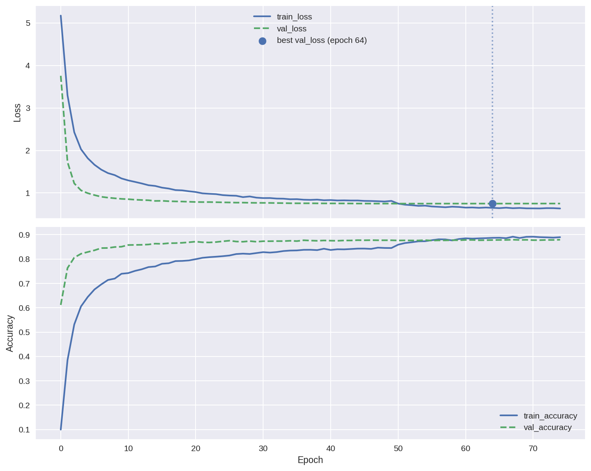
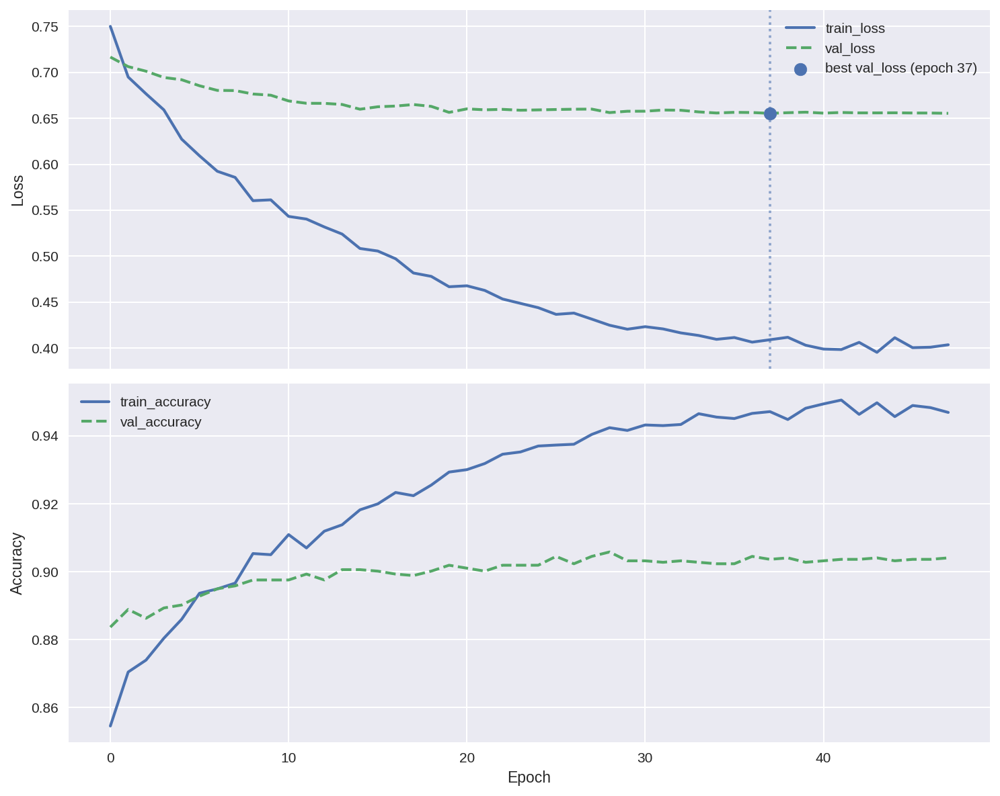
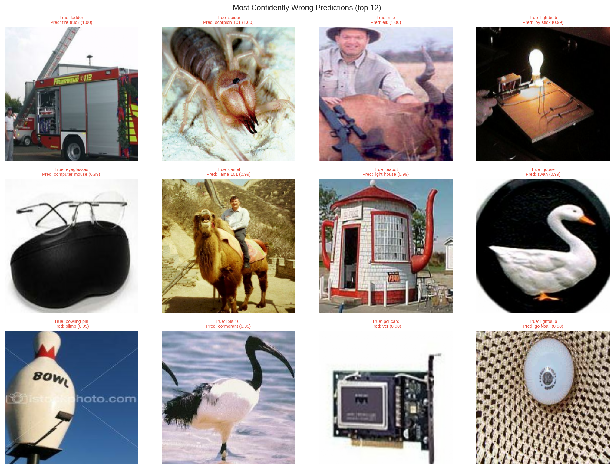
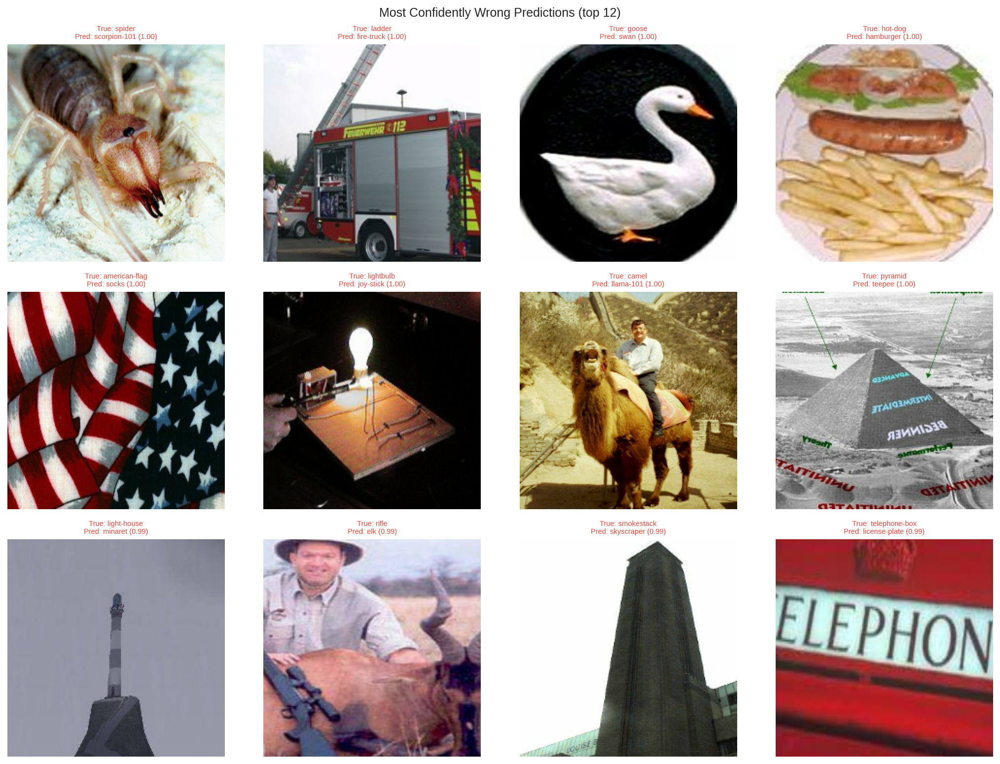
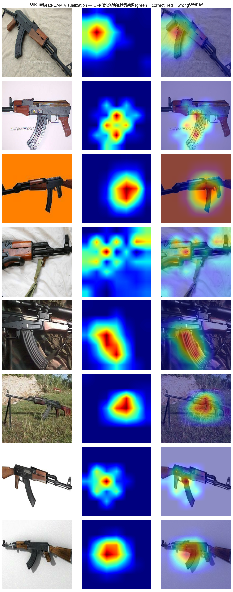
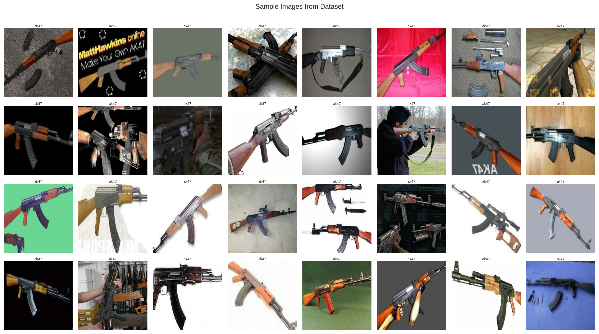
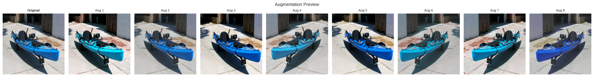

# Caltech-256 Image Classification — EfficientNetV2-S (Two-Phase Transfer Learning)


A structured two-phase transfer learning pipeline that fine-tunes EfficientNetV2-S on the Caltech-256 dataset, progressing from a frozen backbone (Phase 1) to selective top-layer unfreezing (Phase 2), with a custom dual-pooling classifier head, cosine-decay scheduling, and a Colab-safe resumable training system built from scratch.

---

## Table of Contents

- [Project Overview](#project-overview)
- [Repository Structure](#repository-structure)
- [Dataset](#dataset)
- [Model Architecture](#model-architecture)
- [Training Pipeline](#training-pipeline)
  - [Phase 1 — Frozen Backbone](#phase-1--frozen-backbone)
  - [Phase 2 — Partial Fine-Tuning](#phase-2--partial-fine-tuning)
- [Training Configuration](#training-configuration)
- [Results](#results)
  - [Test Set Performance](#test-set-performance)
  - [Training Curves](#training-curves)
  - [Misclassification Analysis](#misclassification-analysis)
  - [Key Takeaways](#key-takeaways)
  - [Limitations](#limitations)
- [Visualizations](#visualizations)
- [Inference](#inference)
- [Reproducibility](#reproducibility)
- [Requirements](#requirements)
- [How to Run](#how-to-run)

---

## Project Overview

256-class image classification at scale is hard — even ImageNet-pretrained backbones need careful tuning to transfer well to Caltech-256's highly diverse, low-resolution, and visually noisy images. This project builds a two-phase transfer learning pipeline on top of EfficientNetV2-S, starting with a fully frozen backbone to train only the classifier head, then selectively unfreezing the top semantic blocks for fine-tuning. A custom `ResumableTrainer` utility handles Colab's session disconnect problem by checkpointing full training state to Google Drive and resuming seamlessly — including early stopping patience — across interruptions.

---

## Repository Structure

```
Caltech_256_Classification/
│
├── caltech_256.ipynb          # Main Colab notebook (all training, evaluation, inference)
├── caltech_256.py             # Auto-exported .py version of the notebook
├── helper_cv.py               # CV utility functions (data loading, augmentation, evaluation, Grad-CAM)
├── resumable_trainer.py       # ResumableTrainer — Colab-safe checkpointing & resume system
│
├── plots/
│   ├── phase1_training_curve.png
│   ├── phase2_training_curve.png
│   ├── phase1_worst_predictions.png
│   ├── phase2_worst_predictions.png
│   ├── grad_cam_grid.png
│   ├── sample_images.png
│   └── augmentation_preview.png
│
├── training_log_phase_1.csv   # Epoch-level metrics for Phase 1 (75 epochs)
├── training_log_phase_2.csv   # Epoch-level metrics for Phase 2 (48 epochs)
│
└── README.md
```

> **Model checkpoints** are too large for GitHub and are saved to Google Drive under `Colab_Experiments/caltech256_efficientnetv2s/`.

---

## Dataset

**Caltech-256** is a 256-class object recognition benchmark with 30,607 images spanning highly diverse categories — from everyday objects to animals, tools, vehicles, and abstract shapes. Each class contains between 80 and 827 images.

| Split | Images | Notes |
|-------|--------|-------|
| Train | ~21,400 | Stratified split; class-weighted sampling |
| Val   | ~4,600  | Stratified split |
| Test  | ~4,600  | Held out, never seen during training |

- **Input resolution:** 224 × 224 × 3 (RGB)
- **Number of classes:** 257 (including the clutter class)
- **Class imbalance:** moderate; addressed with `class_weights` passed to the training pipeline
- **Source:** [Kaggle — narendraiitb27/caltech-256](https://www.kaggle.com/datasets/narendraiitb27/caltech-256)

Splits are saved to Google Drive on first run and loaded from there in all subsequent sessions.

---

## Model Architecture

The model is built on top of **EfficientNetV2-S** (ImageNet pretrained, `include_preprocessing=True`) with a custom **dual-pooling classifier head**.

```
EfficientNetV2-S Backbone (ImageNet weights)
        │
        ├── GlobalAveragePooling2D ──┐
        └── GlobalMaxPooling2D   ──┤
                                    │ Concatenate
                                 BatchNormalization
                                 Dense(512, relu, L2=2e-4)
                                 Dropout(0.5)
                                 Dense(256, relu, L2=2e-4)
                                 Dropout(0.5)
                                 Dense(257, softmax)
```

**Key design choices:**
- **Dual pooling (Avg + Max concatenation):** captures both mean feature activations and peak responses, giving the head richer signal than average pooling alone.
- **L2 regularization** on both Dense layers to prevent overfitting on the relatively small per-class sample sizes.
- **BatchNorm layers in the backbone are always kept frozen**, even when unfreezing other layers in Phase 2 — this prevents statistics drift that would destabilize fine-tuning.

---

## Training Pipeline

Training is structured in two sequential phases. Each phase uses `ResumableTrainer`, which checkpoints every epoch to Google Drive and can resume seamlessly — including restoring early stopping patience — across Colab session disconnects.

### Phase 1 — Frozen Backbone

The entire EfficientNetV2-S backbone is frozen. Only the classifier head is trained. This lets the head learn a good decision boundary on top of frozen ImageNet features before any backbone weights are modified.

- **Unfrozen layers:** classifier head only
- **Optimizer:** Adam, flat LR = `2e-4`
- **Epochs:** up to 75 (early stopping, patience = 10)
- **Best checkpoint:** epoch 64

### Phase 2 — Partial Fine-Tuning

The top semantic blocks of the backbone are selectively unfrozen. The Phase 1 best checkpoint is used as the warm start. A cosine decay schedule gradually reduces the learning rate to prevent destroying the pretrained representations.

- **Unfrozen blocks:** `block6`, `block5`, `top_conv`, `top_bn`, `top_activation`
- **BatchNorm layers:** kept frozen throughout
- **Optimizer:** Adam with CosineDecay (`lr: 1e-5 → 5% of 1e-5`)
- **Epochs:** up to 50 (early stopping, patience = 10)
- **Best checkpoint:** epoch 37

---

## Training Configuration

| Parameter | Phase 1 | Phase 2 |
|-----------|---------|---------|
| Backbone | Frozen | `block5`, `block6`, top layers unfrozen |
| BatchNorm | Frozen | Frozen |
| Optimizer | Adam | Adam + CosineDecay |
| Learning Rate | 2e-4 (flat) | 1e-5 → ~5e-7 (cosine decay) |
| Dropout | 0.5 | 0.5 |
| Batch Size | 128 | 128 |
| Image Size | 224 × 224 | 224 × 224 |
| Max Epochs | 75 | 50 |
| Early Stopping Patience | 10 | 10 |
| Monitor | `val_loss` | `val_loss` |
| Class Weights | Yes | Yes |
| Warm Start | — | Phase 1 best checkpoint |

**Data Augmentation (training only):**
Random horizontal flip, random rotation, random zoom, random contrast, random translation — applied inline in the `tf.data` pipeline.

---

## Results

### Test Set Performance

| Phase | Top-1 Accuracy | Top-5 Accuracy | Best Epoch |
|-------|---------------|---------------|------------|
| Phase 1 — Frozen Backbone | 88.06% | 96.44% | 64 |
| **Phase 2 — Partial Fine-Tuning** | **90.71%** | **97.27%** | **37** |

Phase 2 adds **+2.65 pp Top-1** and **+0.83 pp Top-5** over Phase 1, confirming that selectively unfreezing the top semantic blocks meaningfully improves the model's ability to adapt Caltech-256-specific features.

### Training Curves

**Phase 1** (75 epochs, frozen backbone):



The validation loss converges quickly and plateaus well ahead of the training loss — typical of a frozen backbone. The gap between train and val accuracy reflects the frozen backbone's inability to adapt its representations, not overfitting.

**Phase 2** (48 epochs, top blocks unfrozen):



The training loss decreases steadily while val loss flattens around epoch 37, with the gap between train and val accuracy widening slightly in later epochs — a mild sign the model begins to overfit after the best checkpoint, validating the early stopping setup.

### Misclassification Analysis

**Phase 1 — Most Confidently Wrong Predictions:**



**Phase 2 — Most Confidently Wrong Predictions:**



Several recurring failure patterns appear across both phases:

- **Visual similarity between classes** — `spider` → `scorpion-101`, `goose` → `swan`, `camel` → `llama-101`. These are visually plausible errors; the object shapes are genuinely similar.
- **Context-dominated predictions** — `ladder` → `fire-truck` (the ladder *is* on a fire truck), `lightbulb` → `joy-stick` (shot against a dark electronics background). The model attends to scene context rather than the target object.
- **Fine-grained elongated structures** — `smokestack` → `skyscraper`, `light-house` → `minaret`. All are tall vertical structures; discriminating them requires fine-grained detail the model doesn't consistently resolve.
- **Low intra-class consistency** — `american-flag` → `socks` and `rifle` → `elk` (person holding rifle is prominent) suggest some classes have high within-class visual variability or misleading context.

Phase 2 partially addresses these — some pairs from Phase 1 disappear — but the core failure modes remain, which is expected at 256-class scale.

### Key Takeaways

- Unfreezing only the top two blocks (`block5`, `block6`) with a low cosine-decayed LR is enough to capture a meaningful accuracy gain (+2.65 pp) without destabilizing the pretrained weights.
- The dual-pooling head (Avg + Max concatenation) gives the classifier a richer signal than a standard GlobalAveragePooling head at essentially no cost.
- Early stopping on `val_loss` proved effective in both phases — the best checkpoints (epoch 64 and epoch 37) preceded clear plateaus / slight divergence in later epochs.
- Class imbalance in Caltech-256 is real but mild; `class_weights` helped prevent the model from skewing toward over-represented categories.

### Limitations

- **No full fine-tuning:** A Phase 3 (deeper unfreezing with a very low LR like `5e-5`) was attempted but degraded performance, likely due to the relatively small dataset size and high inter-class visual diversity of Caltech-256. It was removed.
- **Single backbone:** Only EfficientNetV2-S was evaluated. A comparison against EfficientNetV2-M, ConvNeXt-Tiny, or ViT-B/16 would better characterize the architecture's contribution.
- **No test-time augmentation (TTA):** TTA typically adds 0.5–1 pp on fine-grained benchmarks at no training cost.
- **Colab T4 constraint:** The T4's 16 GB VRAM was sufficient but batch size 128 at 224² is near the ceiling — a larger backbone or higher resolution would require gradient accumulation.

---

## Visualizations

### Grad-CAM — What the Model Attends To

Grad-CAM heatmaps generated from the Phase 2 best model on test images. Green title = correct prediction, Red title = wrong prediction.



The heatmaps confirm the model generally attends to the correct object region. In misclassified cases, attention is often distributed over background context rather than the discriminative object part.

### Sample Dataset Images



### Augmentation Preview



### Inference Examples

| Image | Predicted | Confidence |
|-------|-----------|-----------|
| Fighter jet at sunset | fighter-jet | 98.1% |
| Picnic table | picnic-table | 82.8% |
| Thompson submachine gun | rifle | 59.6% |
| Cat on sofa | mattress | 11.4% (incorrect — low-confidence failure) |

The fighter-jet and picnic-table predictions show high-confidence correct outputs. The cat example is a correctly low-confidence failure — the model's top-5 includes no cat-related class, reflecting a genuine out-of-distribution case (cats are not a Caltech-256 class).

---

## Inference

Load the Phase 2 best model and run inference on any custom image using the `predict_image` function from the notebook:

```python
from google.colab import drive
drive.mount('/content/drive')

import tensorflow as tf
import numpy as np
import matplotlib.pyplot as plt
from pathlib import Path
from resumable_trainer import find_checkpoint_root
from helper_cv import get_best_model_path

# Load best model
CKPT_ROOT   = find_checkpoint_root("Colab_Experiments")
PROJECT     = "caltech256_efficientnetv2s"
best_model  = tf.keras.models.load_model(
    get_best_model_path(CKPT_ROOT, PROJECT, "phase_2")
)

# Run inference on a custom image
predict_image(
    image_path  = "/path/to/your/image.jpg",
    model       = best_model,
    class_names = class_names,   # loaded from saved splits
    top_k       = 5
)
```

The function displays the input image alongside a horizontal bar chart of the top-5 predicted classes and their confidence scores.

> Pre-trained weights are available on Google Drive. Link: 

---

## Reproducibility

Global random seed `21` is set at the start of the notebook across all libraries:

```python
import os, random
import numpy as np
import tensorflow as tf

SEED = 21
random.seed(SEED)
np.random.seed(SEED)
tf.random.set_seed(SEED)
tf.keras.utils.set_random_seed(SEED)
os.environ["PYTHONHASHSEED"] = str(SEED)
```

> **Note:** Results may vary slightly across runs due to GPU non-determinism (non-deterministic CUDA ops in cuDNN). The numbers reported in this README were obtained on Google Colab with a **T4** GPU.

---

## Requirements

```
Python        >= 3.10
tensorflow    >= 2.13
numpy
pandas
matplotlib
scikit-learn
kagglehub
Pillow
```

Install with:

```bash
pip install tensorflow numpy pandas matplotlib scikit-learn kagglehub Pillow
```

**Hardware:** A GPU is required. All experiments were run on a **NVIDIA T4 (16 GB VRAM)** via Google Colab. Phase 1 training (75 epochs, batch 128) takes approximately 2–3 hours; Phase 2 (48 epochs) takes approximately 1.5–2 hours.

ImageNet weights for EfficientNetV2-S (~88 MB) are downloaded automatically by Keras on first run.

---

## How to Run

1. Open `caltech_256.ipynb` in Google Colab. Mount Drive and place `kaggle.json` in `MyDrive/Colab_Experiments/`.
2. Run all cells in order. Helper scripts (`helper_cv.py`, `resumable_trainer.py`) are auto-downloaded from GitHub in Section 1.1. The dataset downloads automatically via `kagglehub` on first run (~10 min) and is cached to Drive for subsequent sessions.
3. Training saves a checkpoint after every epoch. If the session disconnects, simply re-run the training cell — `ResumableTrainer` resumes from the last checkpoint with early stopping patience fully restored.
4. To skip training entirely and load the best model directly: `phase2_trainer.load_best_model()`

> Total end-to-end runtime: ~4–5 hours on a T4 GPU. For local execution, replace `find_checkpoint_root("Colab_Experiments")` with a local path.
